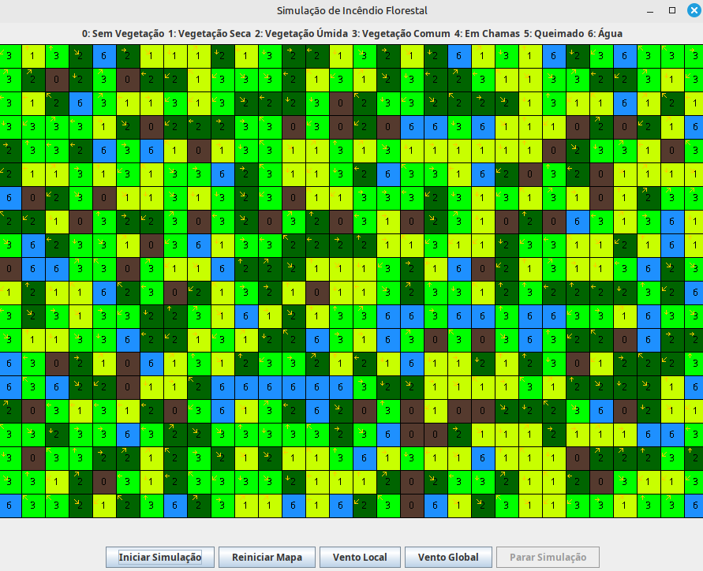
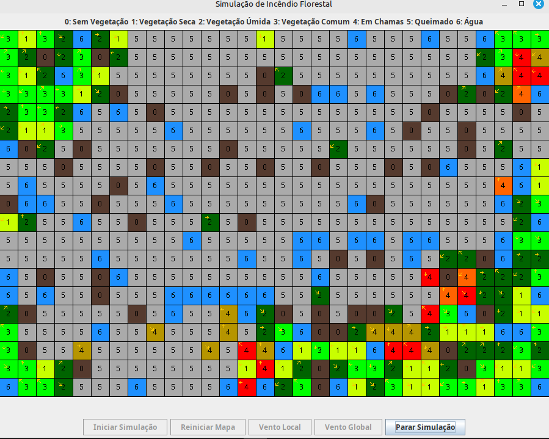

# SInc - Simulador de Incêndios

**Disciplina**: FGA0053 - Sistemas Multiagentes <br>
**Número do Grupo**: 02 <br>
**Frente de Pesquisa** Behaviour<br>

## Alunos
|Matrícula | Aluno |
| -- | -- |
| 232013971  |  Davi Monteiro de Negreiros |
| 200018060  |  Gabriel Ferreira da Silva |
| 170034941  |  Guilherme Peixoto Lima |
| 200058525  |  João Matheus de Oliveira Schmitz |

## Sobre 

O SInc - Simulador de Incêndios, é um simulador baseado no uso de sistema multi agentes, que um  se utilizar de adaptações de formulas de Risco e Propagação de Incêndios e de Fogo com foco em florestas.
Um exemplo é a formula de Rothermel:


- **R**: Velocidade de propagação do fogo (m/s).
- **I_R**: Fluxo de calor na frente do fogo (intensidade do fogo).
- **ξ **: Fator de propagação que depende da estrutura do combustível.
- **φ_W **: Fator de vento, que representa o efeito do vento na propagação do fogo.
- **φ_S **: Fator de inclinação do terreno, que representa o efeito da topografia na propagação do fogo.
- **ρ_b **: Densidade aparente do combustível (massa por volume).
- **ε **: Eficiência da combustão (fração da energia liberada que contribui para a propagação).
- **Q_ig**: Energia necessária para ignição do combustível (calor de ignição).
E a formula de Monte Alegre:


H = umidade relativa do ar em %, medida em 24h horas;
n = número de dias sem chuva maior que 13 mm.

Considerando, também diferentes elementos do ambiente.

Esse simulador de incêndios, é apenas um modelo ou uma simulação teórica. Considerando aspectos básicos do fogo e do ambiente ao seu redor.

## Screenshots

Imagem da Interface Rodando


Imagem do Incêndio Ocorrendo


Imagem do Sniffer com os agentes gerados

## Instalação 
**Linguagens**: JAVA e Python<br>
**Tecnologias**: JADE<br>
**IDE**: Intellij IDEA Community<br>

Possuir o Intellij Idea Community instalado, e baixar o JADE 4.6.0.

Adicione a lib via ```File > Project Structure```

E depois configure no ```Edit Configuration > Application```, com a main class sendo o Main e o argumentos sendo o ```-gui```

### Como rodar o código Python

É necessário ter instalado o python e o pip instalado para rodaar o código abaixo:

```
pip install opencv-python numpy scikit-learn matplotlib pillow
```
Esse código gera mapas a partir de imagens de mapa.

## Uso 

O Simulador de Incêndios Florestais, serve para se ter uma noção simplificada de como incêndios florestais se propagam , dando a possibilidade de pessoas que trabalham nesse ambiente hostil a possilidade de tomada de ações contra esse desatre natural.

## Vídeo

- Ainda será adicionado

## Participações
Apresente, brevemente, como cada membro do grupo contribuiu para o projeto.
| Nome do Membro | Contribuição | Significância da Contribuição para o Projeto (Excelente/Boa/Regular/Ruim/Nula) | Comprobatórios (ex. links para commits) |
|---|---|---|---|
| Davi Monteiro de Negreiros | Responsável por Construção do Mapa e da Interface Gráfica do Simulador | Boa | [Commits](https://github.com/UnBSMA2025-1/2025.1_G2_SMA_SInc-Simulador_de_Incendios/commits?author=DaviNegreiros) |
| Gabriel Ferreira da Silva | Responsável pelo Agente Fogo e suas interações básicas com o Ambiente | Boa | [Commits](https://github.com/UnBSMA2025-1/2025.1_G2_SMA_SInc-Simulador_de_Incendios/commits?author=oo7gabriel) |
| Guilherme Peixoto Lima | Responsável pelo Agente Vento e suas interações com o ambiente e geração de mapas | Boa | [Commits](https://github.com/UnBSMA2025-1/2025.1_G2_SMA_SInc-Simulador_de_Incendios/commits?author=guipeeix7) |
| João Matheus de Oliveira Schmitz | Responsável pelo Geração, Construção de Mapa e Vento | Boa | [Commits](https://github.com/UnBSMA2025-1/2025.1_G2_SMA_SInc-Simulador_de_Incendios/commits?author=JoaoSchmitz) |
## Outros 
Quaisquer outras informações sobre o projeto podem ser descritas aqui. Não esqueça, entretanto, de informar sobre:
(i) Lições Aprendidas;
(ii) Percepções;
(iii) Contribuições e Fragilidades, e
(iV) Trabalhos Futuros.

## Fontes

- Katan, J. and Perez, L.: ABWiSE v1.0: toward an agent-based appdroach to simulating wildfire
  spread, Nat. Hazards Earth Syst. Sci., 21, 3141–3160, https://doi.org/10.5194/nhess-21-3141-
  2021, 2021.
- Oliveira, U., Soares-Filho, B., Rodrigues, H. et al. A near real-time web-system for predicting fire
  spread across the Cerrado biome. Sci Rep 13, 4829 (2023). https://doi.org/10.1038/s41598-023-
  30560-9.
- ANDREWS, Patricia L. The Rothermel Surface Fire Spread Model and Associated Developments: A Comprehensive Explanation. Fort Collins, CO: United States Department of Agriculture, Forest Service, Rocky Mountain Research Station, 2015. General Technical Report RMRS-GTR-371. Disponível em: https://www.fs.usda.gov/rm/pubs_series/rmrs/gtr/rmrs_gtr371.pdf.

