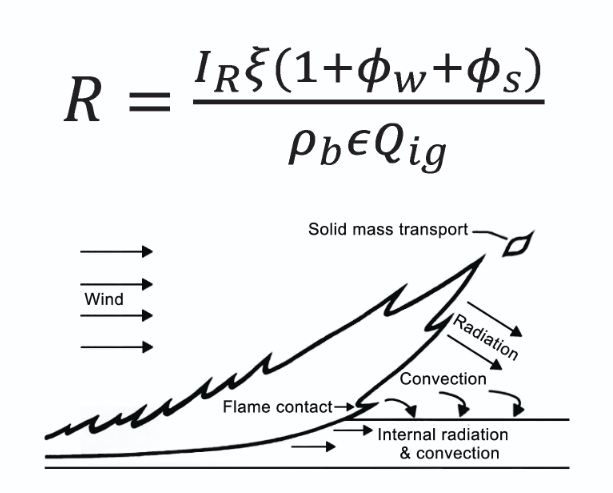
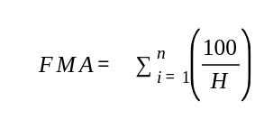
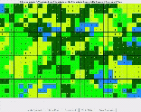
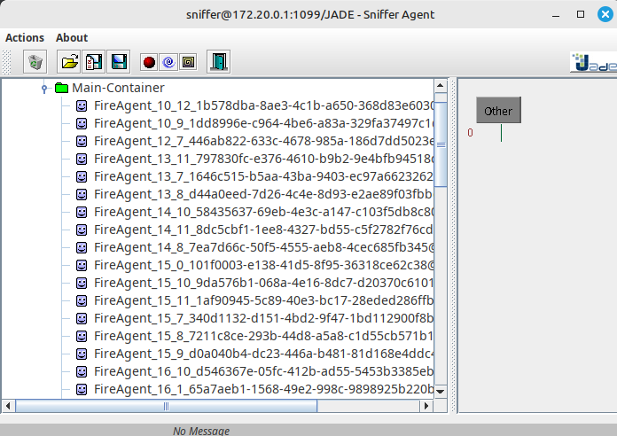
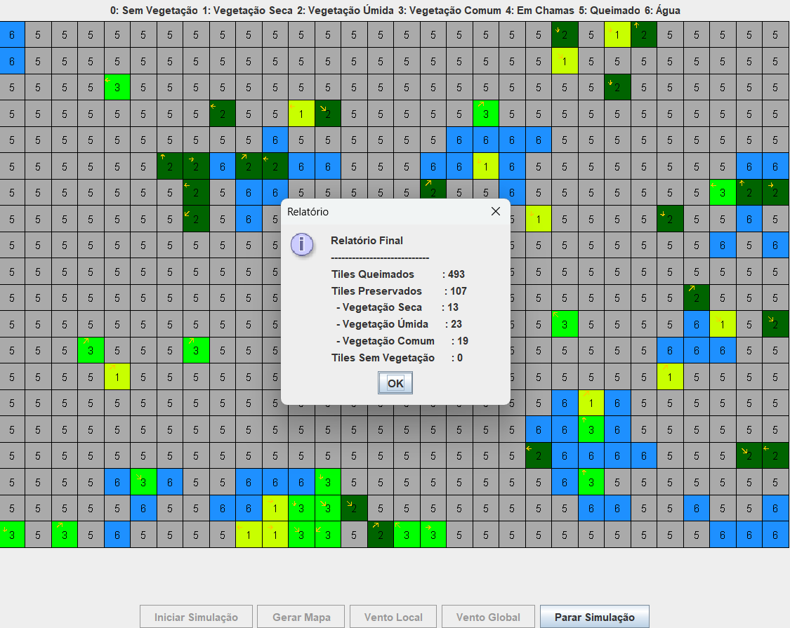

# SInc - Simulador de Incêndios

**Disciplina**: FGA0053 - Sistemas Multiagentes <br>
**Número do Grupo**: 02 <br>
**Frente de Pesquisa** Behaviour<br>

## Alunos
|Matrícula | Aluno |
| -- | -- |
| 232013971  |  Davi Monteiro de Negreiros |
| 200018060  |  Gabriel Ferreira da Silva |
| 170034941  |  Guilherme Peixoto Lima |
| 200058525  |  João Matheus de Oliveira Schmitz |

## Sobre 

O SInc - Simulador de Incêndios, é um simulador baseado no uso de sistema multi agentes, que um  se utilizar de adaptações de formulas de Risco e Propagação de Incêndios e de Fogo com foco em florestas.
Um exemplo é a formula de Rothermel:


- **R**: Velocidade de propagação do fogo (m/s).
- **I_R**: Fluxo de calor na frente do fogo (intensidade do fogo).
- **ξ **: Fator de propagação que depende da estrutura do combustível.
- **φ_W **: Fator de vento, que representa o efeito do vento na propagação do fogo.
- **φ_S **: Fator de inclinação do terreno, que representa o efeito da topografia na propagação do fogo.
- **ρ_b **: Densidade aparente do combustível (massa por volume).
- **ε **: Eficiência da combustão (fração da energia liberada que contribui para a propagação).
- **Q_ig**: Energia necessária para ignição do combustível (calor de ignição).


####  Formula de Monte Alegre:



H = umidade relativa do ar em %, medida em 24h horas;
n = número de dias sem chuva maior que 13 mm.

Considerando, também diferentes elementos do ambiente.

Esse simulador de incêndios, é apenas um modelo ou uma simulação teórica. Considerando aspectos básicos do fogo e do ambiente ao seu redor.

## Screenshots


Geração do mapa usando os SeedAgents



Atuação do fogo na simulação



Imagem do Sniffer com os agentes gerados



Relatório 


## Instalação 
**Linguagens**: JAVA e Python<br>
**Tecnologias**: JADE<br>
**IDE**: Intellij IDEA Community<br>

Possuir o Intellij Idea Community instalado, e baixar o JADE 4.6.0.

Adicione a lib via ```File > Project Structure```

E depois configure no ```Edit Configuration > Application```, com a main class sendo o Main e o argumentos sendo o ```-gui```


[Exemplo de Instalação do Jade no Intellij](https://www.youtube.com/watch?v=DJTJNHxFkvc&pp=ygUVaW50ZWxsaWogbXVsdGkgYWdlbnRl)

### Como rodar o código Python

É necessário ter instalado o python e o pip instalado para rodar o código abaixo:

```
pip install opencv-python numpy scikit-learn matplotlib pillow
```
Esse código gera mapas a partir de imagens de mapa.

## Uso 

O Simulador de Incêndios Florestais, serve para se ter uma noção simplificada de como incêndios florestais se propagam , dando a possibilidade de pessoas que trabalham nesse ambiente hostil a possilidade de tomada de ações contra esse desatre natural.

## Vídeo

[](https://www.youtube.com/watch?v=7JEyCcRTdCs)

## Participações

| Nome do Membro | Contribuição | Significância da Contribuição para o Projeto (Excelente/Boa/Regular/Ruim/Nula) | Comprobatórios (ex. links para commits) |
|---|---|---|---|
| Davi Monteiro de Negreiros | Responsável por Construção do Mapa e da Interface Gráfica do Simulador | Boa | [Commits](https://github.com/UnBSMA2025-1/2025.1_G2_SMA_SInc-Simulador_de_Incendios/commits?author=DaviNegreiros) |
| Gabriel Ferreira da Silva | Responsável pelo Agente Fogo e suas interações básicas com o Ambiente | Boa | [Commits](https://github.com/UnBSMA2025-1/2025.1_G2_SMA_SInc-Simulador_de_Incendios/commits?author=oo7gabriel) |
| Guilherme Peixoto Lima | Responsável pelo Agente Vento e suas interações com o ambiente e geração de mapas | Boa | [Commits](https://github.com/UnBSMA2025-1/2025.1_G2_SMA_SInc-Simulador_de_Incendios/commits?author=guipeeix7) |
| João Matheus de Oliveira Schmitz | Responsável pelo Geração, Construção de Mapa e Vento | Boa | [Commits](https://github.com/UnBSMA2025-1/2025.1_G2_SMA_SInc-Simulador_de_Incendios/commits?author=JoaoSchmitz) |

## Outros 

### Lições Aprendidas

- Ao desenvolver o projeto, a equipe percebeu que criar uma simulação de algo tão complexo como o fogo é um desafio maior e mais interessante do que iniciamente pensávamos, o que nos levou a decisão de simplificar nosso projeto em relação às nossas ideias iniciais.
- A equipe aprendeu muito sobre a utilização do paradigma de Multi Agentes ao implementar vários agentes com propósitos distintos em um mesmo ambiente. O interesse da equipe neste quesito foi bem grande, sendo comum a ocorrência de discussões sobre possíveis melhorias que poderíamos trazer ao projeto no futuro, ou de como o paradigma se compara à outros em certas situações.
- No geral, pode-se dizer que, embora a equipe tenha tido problemas iniciais na implementação do paradigma, nós aprendemos o suficiente para implementá-lo em situações relativamente complexas.

### Percepções

O grupo teve certa, facilidade ao subir projeto e entender onde queríamos chegar para o completar a entrega do projeto, e ao longo do desenvolvimento foi possível identificar que no ramo de desatres naturais e incêndios é possível adicionar mais pontos em projetos futuros, o que pode ser uma ideia interessante de se desenvolver. Em relação aos multi agentes, o grupo percebeu a volatilidade de se trabalhar e entender inicialmente com multi agentes e isso trouxe oportunidades de aprendizados para o grupo. 

### Contribuições e Fragilidades

##### Contribuições
O Grupo realizou a seguintes contribuições:

- Adicionado com sucesso um modelo inicial de Agente Fogo
- Adicionado um gerador de mapas contínuos sem imagens
- Adicionado um gerador de mapas a partir de imagens reais
- Desenvolvimento de Agentes de Vento para influenciar na direção do vento e Agente Seed para ajudar na criação dos mapas.
- Desenvolvimento do interface gráfica interativa, com diferentes tipos de possibildades de iniciar o programa.

##### Fragilidades

- Em computadores fracos o projeto pode travar quando o opção gerar mapa é usada, devido a quantidade de agentes criados o que aumenta a quantidade de processamento
- É necessário rodar o projeto que está no nível de arquivo do SInc-Visual, pelo intellij, e configurar adicionando a lib do jade. 
- O programa pode sofrer alguns bugs, em casos em que contínua mudança de modo global para modo local.

### Trabalhos Futuros

Como dito no tópico anterior, o nosso projeto foi simplificado comparado com as nossas ideias iniciais, sem falar naquelas que descartamos por falta de tempo para a implementação. Após diversas discussões, a equipe levantou vários aspectos onde o projeto pode evoluir. Alguns exemplos são:

- Implementação da altitude de um Tile e a sua influência na direção e velocidade do vento;
- Implementação completa das fórmulas de propagação de fogo;
- Ajustes na influência do vento na propagação do fogo;
- Implementação de agentes bombeiro que apagam o fogo e/ou tomam precauções para que ele não se espalhe;
- Simulação do comportamento de animais silvestres em situações de incêndio florestal;
- Trazer opções para que o usuário:
  - Faça upload de fotos para que estas se transformem em mapas;
  - Escolha o local inicial de um foco de incêndio;
  - Escolha a localização de bases para os agentes bombeiro, para testar qual a melhor posição;
- Entre outras possibilidades.

## Fontes

- Katan, J. and Perez, L.: ABWiSE v1.0: toward an agent-based appdroach to simulating wildfire
  spread, Nat. Hazards Earth Syst. Sci., 21, 3141–3160, https://doi.org/10.5194/nhess-21-3141-
  2021, 2021.
- Oliveira, U., Soares-Filho, B., Rodrigues, H. et al. A near real-time web-system for predicting fire
  spread across the Cerrado biome. Sci Rep 13, 4829 (2023). https://doi.org/10.1038/s41598-023-
  30560-9.
- ANDREWS, Patricia L. The Rothermel Surface Fire Spread Model and Associated Developments: A Comprehensive Explanation. Fort Collins, CO: United States Department of Agriculture, Forest Service, Rocky Mountain Research Station, 2015. General Technical Report RMRS-GTR-371. Disponível em: https://www.fs.usda.gov/rm/pubs_series/rmrs/gtr/rmrs_gtr371.pdf.

